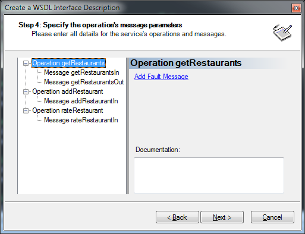

Adding support for fault contracts to [WSCF.blue](http://wscfblue.codeplex.com/) has been on my TODO list for quite a while now. It was left behind when the port to WCF was done because ASMX did not have proper support for fault contracts so it was never actually part of [WSCF.classic](http://wscfclassic.codeplex.com/). Back in the old ASMX days you had to manually set the `Detail` property in the `SoapException` yourself and then add the fault details to the WSDL by hand.

In WCF your fault messages are declared on your operation using the `FaultContractAttribute`. When using WSCF.blue you could manually add the fault details to your WSDL and the appropriate `FaultContractAttribute` would be added to the generated service interface code. The problem was that if you edited your WSDL in the wizard the manually added fault details would be lost. Introducing a manual step like that into your process is something that we all want to avoid. Well, you no longer need to worry about that, because I have now added support for fault contracts to WSCF.blue.

Defining fault messages in your WSDL can be a little different to defining your input and output messages. For example, you can have multiple fault messages for a single operation and the same fault message is often reused for different operations. I decided that the message mapping page of the WSDL Wizard would be a reasonable place to put the configuration for your fault contract.

When you select an operation in the tree control a link label is displayed in the properties pane. Clicking the link will add a new fault message to the operation.



When you select the fault message in the tree control you can then select a type from your schema to be used as the message body. You must provide a name for the message and that name must be unique to the operation. It does not have to be unique to the entire contract though. This means that you can reuse the same message name for a different operation and only a single message will be added to the WSDL. There is also a link label that allows you to remove the fault message if required.


Lets use the fault message being configured in the screen capture above as an example of how this fits together in regards to the XSD and WSDL. The type for the fault in the XSD is called customFault and is an explicitly named `complexType`.

```xml
<xs:complexType name="customFault">
  <xs:sequence>
    <xs:element name="errorCode" type="xs:string"/>
    <xs:element name="message" type="xs:string"/>
    <xs:element maxOccurs="unbounded" minOccurs="0" name="messages" type="xs:string" />
  </xs:sequence>
</xs:complexType>
```

The message is then defined as an `element` with the `type` set to the customFault type. Do not create your fault type as an anonymous type definition directly under the `element` for the message. Doing so will result in an error about a missing data type during code generation.

```xml
<xs:element name="customFault" type="import:customFault" />
```

When the type and message schemas are run through the WSDL Wizard, and the fault message is added as shown in the screen capture above, the resulting WSDL will have a new message defined as follows.

```xml
<message name="customFaultMessage">
  <wsdl:documentation xmlns:wsdl="http://schemas.xmlsoap.org/wsdl/" />
  <part name="fault" element="import0:customFault" />
</message>
```

The `portType` will then have the `fault` defined for the `operation`.

```xml
<operation name="getRestaurants">
  <wsdl:documentation xmlns:wsdl="http://schemas.xmlsoap.org/wsdl/" />
  <input message="tns:getRestaurantsIn" />
  <output message="tns:getRestaurantsOut" />
  <fault name="customFaultMessage" message="tns:customFaultMessage" />
</operation>
```

The `binding` will also have the `fault` defined for the matching `operation`.

```xml
<operation name="getRestaurants">
  <soap:operation soapAction="http://www.thinktecture.com:getRestaurantsIn" style="document" />
  <input>
    <soap:body use="literal" />
  </input>
  <output>
    <soap:body use="literal" />
  </output>
  <fault name="customFaultMessage">
    <soap:fault use="literal" name="customFaultMessage" namespace="" />
  </fault>
</operation>
```

Now when you generate your service code a `FaultContractAttribute` will be applied to the method on your service interface that declares the operation. Note that the `FaultContractAttribute` specifies `customFault` as the type to be used for the message body.

```csharp
[System.ServiceModel.OperationContractAttribute(Action="http://www.foo.com/:getRestaurantsIn", ReplyAction="*")]
[System.ServiceModel.FaultContractAttribute(typeof(customFault), Action="http://www.foo.com/:getRestaurantsIn", Name="customFault", amespace="urn:thinktecture-com:demos:restaurantservice:messages:v1")]
[System.ServiceModel.XmlSerializerFormatAttribute(SupportFaults=true)]
getRestaurantsResponse getRestaurants(getRestaurantsRequest request);
```

There have been a number of requests for fault contract support on the [CodePlex forum](http://wscfblue.codeplex.com/Thread/List.aspx) and I hope that you too will find this helpful. A new V1.0.9 update release is now available on CodePlex for [download](http://wscfblue.codeplex.com/releases/view/46259). Please put this new feature through its paces and report any problems you find on the [discussion forum](http://wscfblue.codeplex.com/Thread/List.aspx).
