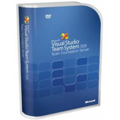

I came across a knowledge base [article](http://support.microsoft.com/kb/949476) by Microsoft Support that describes how to move files between projects in TFS in a way that keeps their history. In short, to keep your history you need to perform the move in the **Source Control Explorer** and then fix up your project files. Performing the move in the **Solution Explorer** causes the project files to be updated immediately, but the history will not be kept because it results in a delete and add operation.

Strangely, the article recommends that you perform the move and check in your changes before fixing up the affected projects. That would put your version control database into an invalid state, and anyone who performed a **Get Latest Version** would find themselves with a solution that does not compile.

You can easily perform all the actions required to complete the move in one **Change Set**. These are the steps I find work well for me:

1.  In the **Solution Explorer**, right-click the files (or folders) you want to move and select **Exclude From Project**. This will check out the project file and remove any references to the items you are about to move.
2.  Use the **Source Control Explorer** to move the items to the new location. The moved items will be checked out and have a pending rename operation.
3.  Back in the **Solution Explorer**, go the the project you moved the items into and click the **Show All Files**button.
4.  You will now see the items you moved marked with a plain white document icon. Right-click the items and select **Include In Project**. This will check out the project file and add a reference to the items you moved.
5.  In your **Pending Changes** window you will see the two project files have edit operations pending, and the moved items have a rename operation pending.
6.  Make sure the solution builds, your unit tests pass and that the changes look correct in your favourite diff tool.
7.  Check in your **Pending Changes**. These changes will all go into one **Change Set**and your version control database will never be in an invalid state. You will of course also have kept your history.

This simple process allows you to keep your source control operations atomic while ensuring you keep your valuable history.
