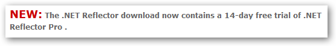

With this latest release of the recently acquired [Reflector](http://www.red-gate.com/products/reflector/index.htm) tool, Red Gate have provided both free and paid versions. The free version only has a couple of new features, the first of which was already available in the [TestDriven.NET](http://www.testdriven.net/) add-in for Visual Studio:

- Jump straight to .NET Reflector from Visual Studio
- Support for .NET 4 assemblies

Red Gate have decided to bundle a trial of the paid version along with the free one. Even though they are still releasing a free version, I find the **forced** bundling of the trial a little annoying. They are certainly trying to sell this as a good thing on their website:

The paid version, marketed as .NET Reflector Pro, is actually a Visual Studio add-in and offers some additional features:

- Integrates the power of .NET Reflector into Visual Studio
- Decompile third-party assemblies from within VS
- Step through decompiled assemblies and use all the debugging techniques you would use on your own code

These certainly are very cool features, but ones that I would like to be given the option of trailing. Regardless, at the end of the day Reflector is still free, and still rocks!
