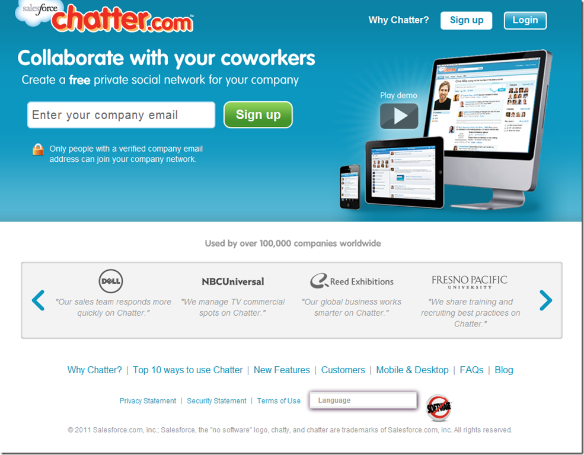

Apparently if you want to be a player in the private social networking space you must adhere to a very specific formula when designing your homepage. Do not forget the company email address input at the top and the list of customers using your product at the bottom. I actually got confused momentarily as to which site I was looking at when jumping between tabs in my browser. There is nothing like standing out from the crowd.

