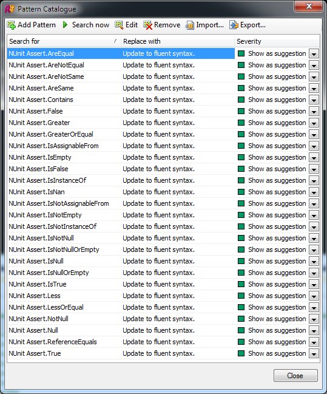
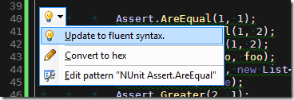

One of the new features in the recently released [ReSharper 5](http://www.jetbrains.com/resharper/whatsnew/index.html) is Structural Search and Replace. This allows you to perform complex searches on your code, and then make equally complex replacements on the resulting matches. You can read the [Introducing ReSharper 5.0: Structural Search and Replace](http://blogs.jetbrains.com/dotnet/2010/04/introducing-resharper-50-structural-search-and-replace/) post on the [JetBrains blog](http://blogs.jetbrains.com/dotnet/) to quickly bring yourself up to speed.

> Solutions are commonly flooded with various code smells that are hard to eliminate right away. ReSharper 5 helps you get rid of them in existing code, but more than that, it allows you to create custom inspections to remove poor coding artifacts on a recurring basis.
>
> Specifically, ReSharper helps configure custom, sharable code patterns, search for them, replace them, include them in code analysis, and even use quick-fixes for regular code maintenance! Building patterns and enforcing good practices has never been this easy. Corporate and team policies, custom frameworks, favorite open source libraries and tools — structured patterns are able to cover them all.

The coolest part of all this is being able to save the Structural Searches and include them alongside the built-in code inspections. [NUnit](http://www.nunit.org/) is my preferred unit testing framework and I really like the fluent API it offers for making assertions. This seemed like the perfect opportunity to test out Structural Search by creating some code patterns that would find usages of the regular API and convert them to the new fluent API.

I basically wanted to find assertions that look this this.

```csharp
object foo = new object();
object nullFoo = null;

Assert.AreEqual(1, 1);
Assert.AreNotEqual(1, 2);
Assert.AreNotSame(1, 2);
Assert.AreSame(foo, foo);
Assert.Contains(1, new List<int> {1, 2, 3});
Assert.False(false);
Assert.Greater(2, 1);
Assert.GreaterOrEqual(2, 1);
Assert.IsAssignableFrom(typeof(int), 1);
Assert.IsNotAssignableFrom(typeof(int), false);
Assert.IsEmpty(new List<int>());
Assert.IsFalse(false);
Assert.IsInstanceOf(typeof(int), 1);
Assert.IsNaN(double.NaN);
Assert.IsNotEmpty(new List<int> {1});
Assert.IsNotInstanceOf(typeof(int), false);
Assert.IsNotNull(foo);
Assert.IsNotNullOrEmpty("Foo");
Assert.IsNull(nullFoo);
Assert.IsNullOrEmpty(string.Empty);
Assert.IsTrue(true);
Assert.Less(1, 2);
Assert.LessOrEqual(1, 2);
Assert.NotNull(new object());
Assert.Null(nullFoo);
Assert.ReferenceEquals(foo, foo);
Assert.True(true);
```

And make them look like this instead.

```csharp
object foo = new object();
object nullFoo = null;

Assert.That(1, Is.EqualTo(1));
Assert.That(2, Is.Not.EqualTo(1));
Assert.That(2, Is.Not.SameAs(1));
Assert.That(foo, Is.SameAs(foo));
Assert.That(new List<int> {1, 2, 3}, Contains.Item(1));
Assert.That(false, Is.False);
Assert.That(2, Is.GreaterThan(1));
Assert.That(2, Is.GreaterThanOrEqualTo(1));
Assert.That(1, Is.AssignableFrom<int>());
Assert.That(false, Is.Not.AssignableFrom<int>());
Assert.That(new List<int>(), Is.Empty);
Assert.That(false, Is.False);
Assert.That(1, Is.InstanceOf<int>());
Assert.That(double.NaN, Is.NaN);
Assert.That(new List<int> {1}, Is.Not.Empty);
Assert.That(false, Is.Not.InstanceOf<int>());
Assert.That(foo, Is.Not.Null);
Assert.That("Foo", Is.Not.Null.Or.Empty);
Assert.That(nullFoo, Is.Null);
Assert.That(string.Empty, Is.Null.Or.Empty);
Assert.That(true, Is.True);
Assert.That(1, Is.LessThan(2));
Assert.That(1, Is.LessThanOrEqualTo(2));
Assert.That(new object(), Is.Not.Null);
Assert.That(nullFoo, Is.Null);
Assert.That(foo, Is.SameAs(foo));
Assert.That(true, Is.True);
```

Nothing particularly difficult in this task other than a fair dose of pounding on the keyboard. After creating the first couple of patterns using the Pattern Catalogue dialog in Visual Studio, I exported the patterns to an XML file and continued my editing from there. Working directly with the XML in your favourite editor will certainly save you some time when making edits to your patterns in bulk. The end result was the list of code patterns below.



Now ReSharper will include these code patterns into its code inspections, and show the usual visual indicators for the Suggestion severity level.



JetBrains have given me yet another reason to love ReSharper. You can find an XML export of the code patterns attached.

[NUnit Fluent API Code Patterns.xml](/static/files/NUnit Fluent API Code Patterns.xml)
