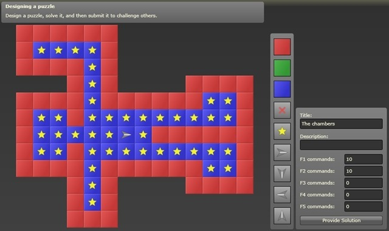

The next time you have a few minutes downtime be sure to check out [RoboZZle](http://www.robozzle.com/), a cool little Silverlight game that requires very basic programming skills.

> [RoboZZle](http://robozzle.com) is an online puzzle game that challenges players to program a robot to pick up all stars on a game board. The game mechanics are simple, yet allow for a wide variety of challenges that call for very different solution approaches. - The creator of the game, Igor Ostrovsky.

If your super keen you can keep up with the latest RoboZZle happenings on the [blog](http://robozzle.com/blog/) and [forums](http://robozzle.com/forums/). Here is a screen capture taken from the blog to give you a feel for it.

